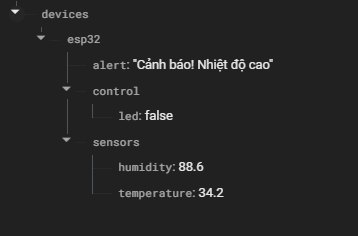

# IoT ESP32 Firebase App

An end-to-end IoT project using **ESP32**, **Firebase Realtime Database**, and an **Android mobile application**. This project allows you to:

- Control an LED remotely via Android app
- Monitor temperature and humidity in real-time using DHT11/DHT22 sensors
- View live data updates from Firebase

---

## 📌 Project Overview

This repository contains two main components:

### 1. ArduinoESP32
- Code for ESP32 using the Firebase ESP Client Library
- Connects to Wi-Fi and syncs with Firebase Realtime Database
- Reads temperature and humidity from DHT sensor
- Controls LED via Firebase commands sent from the Android app

### 2. AndroidApp
- Native Android app (Java)
- Reads and displays real-time sensor values from Firebase
- Sends ON/OFF commands to control the ESP32 LED

---

## 🔧 Features

| Feature | Description |
|--------|-------------|
| 🔥 Firebase | Realtime Database for data sync |
| 📱 Android | UI to view and control ESP32 |
| 📶 ESP32 | Wi-Fi enabled microcontroller |
| 🌡️ DHT11/DHT22 | Reads temperature & humidity |
| 💡 LED Control | Toggle LED via app |

---

## 🚀 Getting Started

### Prerequisites

- ESP32 board
- DHT11/DHT22 sensor
- LED + Resistor
- Firebase Account
- Android Studio
- Arduino IDE

---

## 🔌 Wiring ESP32

| ESP32 Pin | Component |
|-----------|-----------|
| GPIO 4    | LED (via 220Ω resistor) |
| GPIO 5    | DHT DATA pin |
| 3.3V      | DHT VCC |
| GND       | DHT GND |

*Change pins in code if necessary.*

---

## ⚙️ Firebase Setup

1. Go to [Firebase Console](https://console.firebase.google.com/)
2. Create a new project
3. Enable **Realtime Database**
4. Copy the database URL and secret key
5. Add to both:
   - `ArduinoESP32` code (`firebaseData.h`)
   - `AndroidApp` (`google-services.json` + code)

---

## 🧠 Library Requirements

Install the following libraries in Arduino IDE:

- Firebase ESP Client (by Mobizt)
- DHT Sensor Library
- Adafruit Unified Sensor
- WiFi (built-in for ESP32)

---

## 📲 Android App Setup

1. Open `AndroidApp` in Android Studio
2. Add your Firebase config (`google-services.json`)
3. Sync Gradle
4. Run on emulator or real device

---

## 📷 Firebase Realtime Structure

/ESP32
├── Temperature: 25.0
├── Humidity: 60
└── LED: ON

---

## 🖼️ Screenshots

| Android UI | Firebase DB |
|------------|-------------|
|  |  |

---

## 📃 License

This project is licensed under the MIT License - see the [LICENSE](LICENSE) file for details.

---

## 🙋‍♂️ Author

**TranBang**  
[GitHub Profile](https://github.com/tbangg1308)

---

